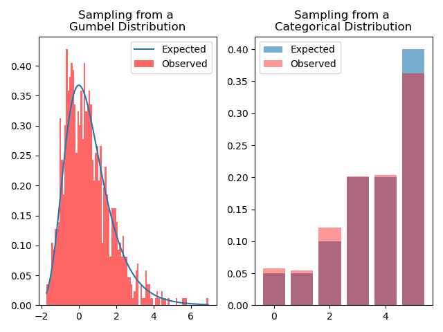
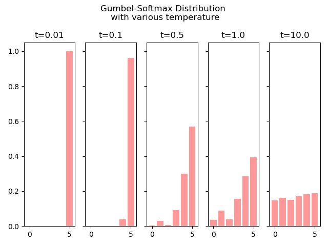

# gumbel-softmax
https://arxiv.org/abs/1611.01144

Plot of pdf of Gumbel distribution and Plot of histogram of approximation of (unnormalized) categorical distribution [0.01, 0.1, 0.5, 1.0, 10] by sampling from a non-differentiable gumbel-softmax distribution 

Plot of a single sample from a differentiable gumbel-softmax distribution with various temperature. Small temperature values are closer to the categorical distribution and larger values of temperature are closer to uniform distribution. The gumbel-softmax distribution is equal to the categorical distribution in the limit of temperature tending to zero. 

